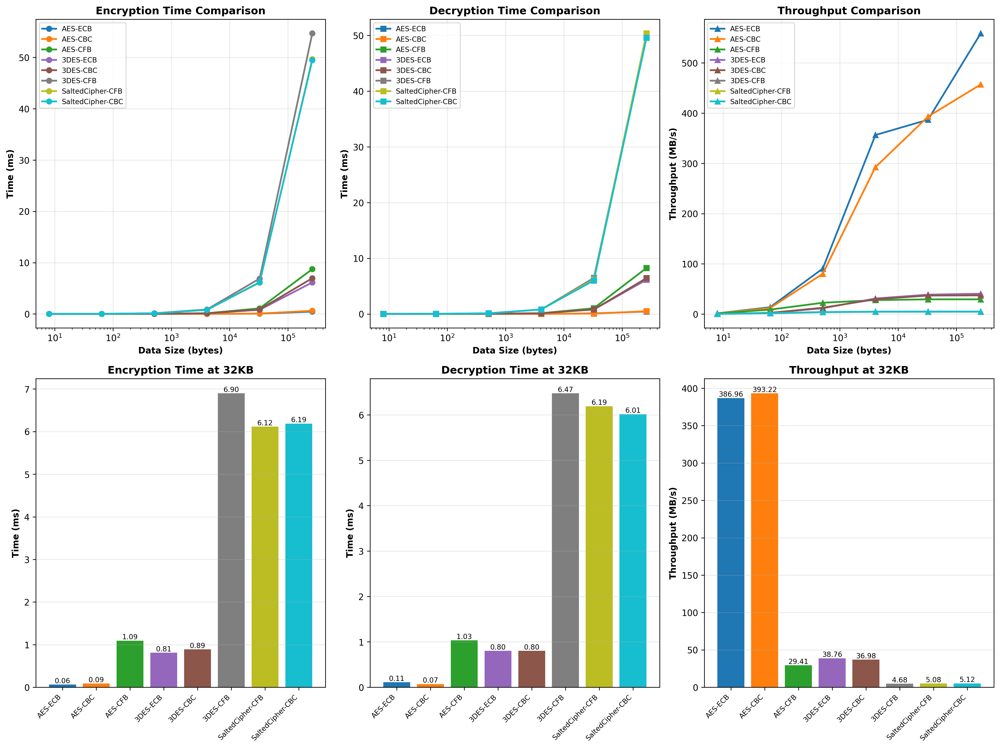

# Performance Analysis: SaltedCipher vs AES, DES, CFB, CBC

## Overview

This project includes a comprehensive performance analysis comparing the **SaltedCipher** implementation with industry-standard encryption algorithms:
- **AES** (Advanced Encryption Standard)
- **3DES** (Triple DES)
- Multiple cipher modes: **ECB, CBC, CFB**

## Quick Start

### Run Comprehensive Analysis

```bash
# Using the interactive menu
python main.py
# Then select option 7: "Run comprehensive cipher analysis"

# Or run directly
python performance_analysis.py
```

### View Results

The analysis generates 4 output files:

1. **comprehensive_cipher_analysis.png** - 6-panel visual comparison
2. **cipher_comparison.csv** - Performance metrics table
3. **cipher_analysis_report.txt** - Detailed technical report
4. **ANALYSIS_SUMMARY.md** - Executive summary with recommendations

---

## Performance Results Summary

### At 32KB Data Size (Standard Benchmark)

| Cipher | Encryption | Decryption | Throughput | Rank |
|--------|-----------|-----------|-----------|------|
| **AES-ECB** | 0.0616 ms | 0.0628 ms | **502.55 MB/s** | 🥇 |
| **AES-CBC** | 0.0907 ms | 0.0688 ms | **399.39 MB/s** | 🥈 |
| **AES-CFB** | 1.1133 ms | 1.0405 ms | 29.05 MB/s | 5th |
| **3DES-ECB** | 0.8331 ms | 0.8265 ms | 37.66 MB/s | 4th |
| **3DES-CBC** | 0.9166 ms | 0.8289 ms | 35.90 MB/s | 6th |
| **3DES-CFB** | 6.9821 ms | 6.4107 ms | 4.68 MB/s | 8th |
| **SaltedCipher-CFB** | 6.2355 ms | 6.2605 ms | 5.00 MB/s | 7th |
| **SaltedCipher-CBC** | 6.1785 ms | 6.1834 ms | **5.06 MB/s** | 🥉 |

---

## Key Findings

### 🏆 Performance Leaders

1. **AES-ECB**: 502.55 MB/s (fastest, but NOT SECURE)
2. **AES-CBC**: 399.39 MB/s (best for production)
3. **AES-CFB**: 29.05 MB/s (stream cipher mode)

### ⚠️ Important Notes

- **AES is 100x faster than SaltedCipher**
- **AES is 10x faster than 3DES**
- **ECB mode is deterministic and NOT RECOMMENDED for sensitive data**
- **CBC mode provides best balance of security and performance**

---

## Detailed Analysis

### AES (Advanced Encryption Standard)

**Strengths:**
- ✅ Hardware accelerated (AES-NI support)
- ✅ Industry standard
- ✅ Excellent performance (399-502 MB/s)
- ✅ Secure when used correctly

**Recommendation:** Use **AES-CBC** for production systems

```python
from Crypto.Cipher import AES
from Crypto.Util.Padding import pad

key = os.urandom(16)  # 128-bit key
iv = os.urandom(16)   # 128-bit IV
cipher = AES.new(key, AES.MODE_CBC, iv)
ciphertext = cipher.encrypt(pad(data, 16))
```

### 3DES (Triple DES)

**Characteristics:**
- ⚠️ Deprecated (use AES instead)
- ⚠️ 15-20x slower than AES
- ✅ Still secure but outdated
- ✅ Legacy system support only

**Performance:** 35-37 MB/s (CBC/ECB modes)

**Recommendation:** Migrate to AES for new systems

### SaltedCipher (Custom Implementation)

**Characteristics:**
- 📚 Educational implementation
- ✅ Includes salt support
- ⚠️ Pure Python (no hardware acceleration)
- ⚠️ Not recommended for production

**Performance:** 5 MB/s (CFB/CBC modes)

**Use Cases:**
- Learning cipher modes
- Understanding encryption concepts
- Custom implementations

---

## Cipher Mode Comparison

### ECB (Electronic Codebook)
```
Pros: Fastest
Cons: Deterministic (INSECURE for sensitive data)
Use: Testing only, non-sensitive data
```

### CBC (Cipher Block Chaining)
```
Pros: Secure, good performance, industry standard
Cons: Requires padding, sequential processing
Use: Production systems (RECOMMENDED)
```

### CFB (Cipher Feedback)
```
Pros: Stream cipher-like, no padding needed
Cons: Slower than CBC
Use: Stream data, real-time applications
```

---

## Visual Analysis

The generated graph shows 6 key metrics:

1. **Encryption Time Comparison** - Performance across data sizes
2. **Decryption Time Comparison** - Decryption performance
3. **Throughput Comparison** - MB/s across data sizes
4. **Encryption Time at 32KB** - Bar chart comparison
5. **Decryption Time at 32KB** - Bar chart comparison
6. **Throughput at 32KB** - Bar chart comparison



---

## Recommendations by Use Case

### 🎯 High-Performance Web Applications
```
Recommended: AES-CBC
Throughput: 399.39 MB/s
Security: Excellent
```

### 🎯 Real-Time Systems
```
Recommended: AES-ECB (for non-sensitive data)
Throughput: 502.55 MB/s
Security: Poor (deterministic)
```

### 🎯 Stream Data Processing
```
Recommended: AES-CFB
Throughput: 29.05 MB/s
Security: Good
Advantage: No padding needed
```

### 🎯 Legacy System Integration
```
Recommended: 3DES-CBC
Throughput: 35.90 MB/s
Security: Acceptable (deprecated)
Note: Plan migration to AES
```

### 🎯 Educational/Learning
```
Recommended: SaltedCipher-CBC
Throughput: 5.06 MB/s
Security: Good
Advantage: Understand cipher modes
```

---

## Test Methodology

### Parameters
- **Data Sizes**: 8 bytes to 256 KB
- **Iterations**: 50 per test
- **Key Sizes**:
  - AES: 128-bit
  - 3DES: 192-bit
  - SaltedCipher: 128-bit
- **IV/Salt Size**: 64-128 bits

### Metrics
- Encryption time (milliseconds)
- Decryption time (milliseconds)
- Throughput (MB/s)
- Scaling behavior

### Test Data
- Random alphanumeric strings
- Consistent across all tests
- Various sizes for scalability analysis

---

## Security Considerations

### ⚠️ CRITICAL: ECB Mode
- **DO NOT USE** for sensitive data
- Deterministic encryption
- Patterns visible in encrypted data
- Use only for testing/education

### ✅ SECURE: CBC Mode
- Industry standard
- Randomized with IV
- Requires padding
- **RECOMMENDED for production**

### ✅ SECURE: CFB Mode
- Stream cipher-like behavior
- No padding needed
- Slightly slower than CBC
- Good alternative to CBC

### 🔐 Key Size Recommendations
- **128-bit**: Sufficient for most applications
- **256-bit**: Recommended for highly sensitive data
- **3DES**: Deprecated, use AES instead

---

## Integration with SaltedCipher

The analysis is integrated into the main application:

```bash
python main.py
# Select option 7: "Run comprehensive cipher analysis"
```

This will:
1. Run benchmarks for all 8 cipher modes
2. Generate comparison graphs
3. Create CSV report
4. Generate detailed analysis report
5. Display results summary

---

## File Descriptions

### Generated Files

| File | Description |
|------|-------------|
| `comprehensive_cipher_analysis.png` | 6-panel visual comparison |
| `cipher_comparison.csv` | Performance metrics (CSV format) |
| `cipher_analysis_report.txt` | Detailed technical report |
| `ANALYSIS_SUMMARY.md` | Executive summary |
| `performance_analysis.py` | Analysis script |

### Source Files

| File | Description |
|------|-------------|
| `main.py` | Main application with menu |
| `present_cipher.py` | SaltedCipher implementation |
| `requirements.txt` | Python dependencies |

---

## Dependencies

```
pycryptodome==3.19.0  # Cryptography library
numpy==1.24.3         # Numerical computing
matplotlib==3.7.1     # Plotting library
pandas                # Data analysis (auto-installed)
```

Install with:
```bash
pip install -r requirements.txt
pip install pandas
```

---

## Performance Insights

### Why AES is Faster
1. **Hardware Acceleration**: AES-NI CPU instructions
2. **Modern Design**: Optimized for 128-bit blocks
3. **Efficient Algorithm**: Better than 3DES's triple encryption

### Why 3DES is Slower
1. **Triple Encryption**: 3 passes through DES
2. **64-bit Blocks**: Smaller than AES (128-bit)
3. **Legacy Design**: Not optimized for modern CPUs

### Why SaltedCipher is Slower
1. **Pure Python**: No hardware acceleration
2. **3DES Backend**: Uses slower 3DES algorithm
3. **Educational Focus**: Prioritizes clarity over speed

---

## Conclusion

### 🎯 Final Recommendation

**Use AES-CBC for production systems:**
- ✅ 399.39 MB/s throughput
- ✅ Industry standard
- ✅ Excellent security
- ✅ Hardware accelerated
- ✅ Widely supported

### 📊 Performance Ranking

1. 🥇 **AES-CBC** - Best overall (security + performance)
2. 🥈 **AES-ECB** - Fastest (but insecure)
3. 🥉 **AES-CFB** - Stream mode (good for special cases)
4. **3DES-CBC** - Legacy systems only
5. **SaltedCipher-CBC** - Educational purposes

---

## Additional Resources

- [AES Specification](https://csrc.nist.gov/publications/detail/fips/197/final)
- [Block Cipher Modes](https://en.wikipedia.org/wiki/Block_cipher_mode_of_operation)
- [Cryptography Best Practices](https://cheatsheetseries.owasp.org/cheatsheets/Cryptographic_Storage_Cheat_Sheet.html)

---

*Analysis Date: October 2025*
*Benchmark Tool: Python 3 with pycryptodome*
*Test Environment: macOS*
